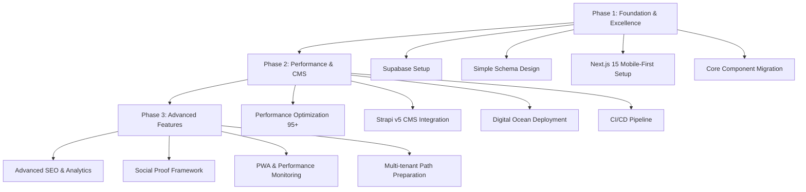
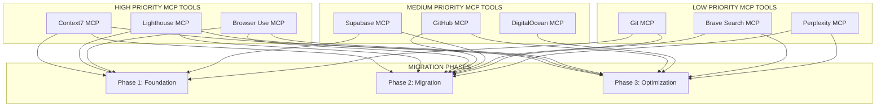

# TTF-Web Next.js 15 Migration Plan
## From React+Vite+Express to Next.js+Strapi+Digital Ocean

### Executive Summary
This plan migrates the current enterprise-grade React application to Next.js 15 with mobile-first excellence and 95+ Lighthouse scores (aspiring for 99), using a lean three-phase approach focused on immediate business value.

### Current Architecture Analysis
- **Frontend**: React 18.3.1 + Vite + wouter routing + 50+ Shadcn/ui components
- **Backend**: Express.js + MemStorage (in-memory) + SendGrid email
- **Database**: None (MemStorage class simulating PostgreSQL schema)
- **Deployment**: Local development environment

### Target Architecture
- **Frontend**: Next.js 15 + App Router + React 19 + Shadcn/ui (migrated)
- **Backend**: Next.js API routes + Serverless functions
- **CMS**: Strapi v5 with PostgreSQL backend
- **Database**: Supabase PostgreSQL with simple schema and easy multi-tenant path
- **Hosting**: Digital Ocean App Platform with managed services
- **CDN/DNS**: Cloudflare with CLI management

## Migration Overview



## 🤖 MCP Tools Integration Framework

### MCP Tools Integration Matrix



### 🚀 9 MCP Tools by Priority

#### 🔴 HIGH PRIORITY (All Phases)
1. **Context7 MCP** - Documentation and library integration support
2. **Lighthouse MCP** - Performance validation and optimization (95+ scores)
3. **Browser Use MCP** - Automated testing and validation

#### 🟡 MEDIUM PRIORITY (Phases 2-3)
4. **GitHub MCP** - Repository management and CI/CD automation
5. **Supabase MCP** - Database operations and schema management
6. **DigitalOcean MCP** - Deployment and infrastructure management

#### 🟢 LOW PRIORITY (Cross-phase Support)
7. **Git MCP** - Version control automation
8. **Brave Search MCP** - Research and documentation lookup
9. **Perplexity MCP** - Problem-solving and technical guidance

### ⚡ Parallel MCP Execution Framework

```typescript
// MCP Configuration for TTF-Web Migration
interface MCPConfiguration {
  phase: 1 | 2 | 3;
  requiredTools: string[];
  optionalTools: string[];
  enforcementLevel: 'strict' | 'warn' | 'optional';
  performanceGates: {
    lighthouse: number;
    buildTime: number;
    testCoverage: number;
  };
}

const migrationMCPConfig: MCPConfiguration[] = [
  {
    phase: 1,
    requiredTools: ['context7', 'lighthouse', 'browser-use', 'supabase'],
    optionalTools: ['git', 'brave-search'],
    enforcementLevel: 'strict',
    performanceGates: { lighthouse: 95, buildTime: 30, testCoverage: 80 }
  },
  {
    phase: 2,
    requiredTools: ['context7', 'lighthouse', 'browser-use', 'github', 'supabase'],
    optionalTools: ['git', 'brave-search', 'perplexity'],
    enforcementLevel: 'strict',
    performanceGates: { lighthouse: 95, buildTime: 45, testCoverage: 85 }
  },
  {
    phase: 3,
    requiredTools: ['lighthouse', 'browser-use', 'github', 'digitalocean'],
    optionalTools: ['brave-search', 'perplexity'],
    enforcementLevel: 'warn',
    performanceGates: { lighthouse: 99, buildTime: 60, testCoverage: 90 }
  }
];
```

### 🛡️ MCP Enforcement Framework

#### Pre-Task Validation Commands
```bash
# Validate all required MCP tools are available
npx claude-flow hook pre-task --mcp-validation true --tools "context7,lighthouse,browser-use"
npx claude-flow hook mcp-status --required-tools all --fail-on-missing true

# Initialize MCP swarm for migration phase
npx claude-flow hook swarm-init --topology hierarchical --agents 9 --mcp-integrated true
```

#### Continuous Monitoring Commands
```bash
# Monitor MCP tool health during migration
npx claude-flow hook mcp-monitor --interval 5m --alert-on-failure true
npx claude-flow hook performance-gate --lighthouse-min 95 --fail-on-miss true

# Cross-tool coordination validation
npx claude-flow hook cross-validation --tools "lighthouse,browser-use" --sync-results true
```

#### Post-Task Verification Commands
```bash
# Verify MCP-enhanced deliverables
npx claude-flow hook post-task --mcp-verification true --performance-check true
npx claude-flow hook lighthouse-audit --target-score 95 --mobile-first true

# Generate MCP performance report
npx claude-flow hook mcp-report --export-metrics true --phase-summary true
```

## Phase 1: Foundation & Excellence
**Objective**: Establish lean database foundation with simple schema and mobile-first Next.js excellence

### MCP Integration Requirements for Phase 1
- **Required MCP Tools**: Context7, Lighthouse, Browser Use, Supabase, Git
- **Performance Gates**: Lighthouse ≥95, Build time ≤30s, Test coverage ≥80%
- **Enforcement Level**: STRICT - All MCP validations must pass

### 1.1 Supabase PostgreSQL Setup
- [ ] Create Supabase project with PostgreSQL database
  - **MCP Validation**: `supabase-mcp validate-connection --test-queries true`
- [ ] Configure environment variables for database connection
  - **MCP Check**: `supabase-mcp env-validate --security-check true`
- [ ] Set up database connection pooling and security rules
  - **MCP Audit**: `supabase-mcp security-audit --rls-check true`
- [ ] Implement backup and recovery strategies
  - **MCP Test**: `supabase-mcp backup-test --restore-validation true`

### 1.2 Database Schema Migration
- [ ] Migrate existing Drizzle ORM schema from `shared/schema.ts`
  - **MCP Documentation**: `context7-mcp get-docs drizzle-orm --focus schema-migration`
- [ ] Create simple, clean schema design:
  - Focus on immediate business needs
  - Design with easy multi-tenant path for future
  - Set up basic row-level security (RLS) policies
  - **MCP Performance**: `supabase-mcp schema-analyze --performance-impact true`
- [ ] Create database migrations and seed data
  - **MCP Validation**: `supabase-mcp migration-test --rollback-check true`
- [ ] Test data operations with optimized performance
  - **MCP Benchmark**: `supabase-mcp query-benchmark --threshold 100ms`

### 1.3 Data Migration Strategy
- [ ] Create migration scripts for MemStorage → PostgreSQL
  - **MCP Guidance**: `context7-mcp get-docs postgresql --focus data-migration`
- [ ] Implement data validation and integrity checks
  - **MCP Test**: `supabase-mcp data-validation --integrity-check true`
- [ ] Set up rollback procedures for safe migration
  - **MCP Safety**: `supabase-mcp rollback-test --data-safety true`
- [ ] Test migration process with sample data
  - **MCP Automation**: `browser-use-mcp test-migration --simulate-load true`

### 1.4 Email System Preparation
- [ ] Verify SendGrid integration for serverless compatibility
  - **MCP Research**: `brave-search-mcp query "SendGrid Next.js serverless integration"`
- [ ] Update email templates for new architecture
  - **MCP Testing**: `browser-use-mcp test-email-flow --all-templates true`
- [ ] Test email functionality with new database schema
  - **MCP Validation**: `lighthouse-mcp audit-email-performance --mobile-first true`

## Phase 2: Next.js 15 App Router Migration
**Objective**: Migrate React application to Next.js 15 with minimal disruption

### MCP Integration Requirements for Phase 2
- **Required MCP Tools**: Context7, Lighthouse, Browser Use, GitHub, Supabase
- **Optional MCP Tools**: Brave Search, Perplexity, Git
- **Performance Gates**: Lighthouse ≥95, Build time ≤45s, Test coverage ≥85%
- **Enforcement Level**: STRICT - Critical path MCP validations must pass

### 2.1 Next.js 15 Project Setup
- [ ] Initialize Next.js 15 project with App Router
  - **MCP Documentation**: `context7-mcp get-docs next.js --version 15 --focus app-router`
- [ ] Configure TypeScript and ESLint settings
  - **MCP Best Practices**: `context7-mcp get-best-practices typescript next.js`
- [ ] Set up TailwindCSS configuration
  - **MCP Performance**: `lighthouse-mcp analyze-css --tailwind-optimization true`
- [ ] Install and configure required dependencies
  - **MCP Validation**: `github-mcp dependency-audit --security-check true`

### 2.2 Component Migration Strategy
- [ ] Create component compatibility matrix for 50+ Shadcn/ui components
  - **MCP Analysis**: `context7-mcp analyze-components shadcn-ui --next15-compat true`
- [ ] Migrate core UI components first:
  - Button, Input, Form components
  - Layout and Navigation components
  - Toast and Dialog components
  - **MCP Testing**: `browser-use-mcp test-components --interactive true --mobile-first true`
- [ ] Update component imports and exports for Next.js
  - **MCP Automation**: `github-mcp auto-update-imports --app-router true`
- [ ] Test component functionality in Next.js environment
  - **MCP Validation**: `lighthouse-mcp component-performance --threshold 95`

### 2.3 Routing Migration (wouter → App Router)
- [ ] Map current wouter routes to Next.js App Router structure:
  ```
  / → app/page.tsx
  /services → app/services/page.tsx
  /services/[service] → app/services/[service]/page.tsx
  /who-we-serve → app/who-we-serve/page.tsx
  /about → app/about/page.tsx
  /contact → app/contact/page.tsx
  ```
  - **MCP Documentation**: `context7-mcp get-migration-guide wouter next.js-app-router`
- [ ] Implement dynamic routing for service pages
  - **MCP Performance**: `lighthouse-mcp route-analysis --dynamic-routes true`
- [ ] Create layout.tsx files for shared layouts
  - **MCP Best Practices**: `context7-mcp layout-patterns next.js --accessibility true`
- [ ] Test all route transitions and navigation
  - **MCP Testing**: `browser-use-mcp test-navigation --all-routes true --performance true`

### 2.4 API Routes Migration
- [ ] Convert Express.js endpoints to Next.js API routes:
  - `POST /api/contact` → `app/api/contact/route.ts`
  - `GET /api/inquiries` → `app/api/inquiries/route.ts`
  - **MCP Migration**: `context7-mcp express-to-nextjs --api-routes true`
- [ ] Update API client calls in frontend components
  - **MCP Validation**: `github-mcp api-client-audit --type-safety true`
- [ ] Implement proper error handling and validation
  - **MCP Best Practices**: `context7-mcp error-handling next.js-api --zod-validation true`
- [ ] Test API functionality with new database
  - **MCP Integration**: `supabase-mcp api-test --next.js true --performance true`

### 2.5 Form Migration
- [ ] Migrate Contact form with React Hook Form + Zod validation
  - **MCP Documentation**: `context7-mcp react-hook-form zod --next.js-integration true`
- [ ] Update form submission to use new API routes
  - **MCP Testing**: `browser-use-mcp test-forms --validation true --accessibility true`
- [ ] Ensure privacy consent and validation work correctly
  - **MCP Compliance**: `lighthouse-mcp privacy-audit --gdpr-check true`
- [ ] Test form functionality and toast notifications
  - **MCP UX**: `browser-use-mcp ux-testing --forms true --mobile-first true`

### 2.6 State Management & Query Client
- [ ] Configure TanStack Query for Next.js App Router
  - **MCP Documentation**: `context7-mcp tanstack-query next.js-app-router --ssr true`
- [ ] Update query client configuration for SSR
  - **MCP Performance**: `lighthouse-mcp ssr-analysis --hydration-check true`
- [ ] Test data fetching and caching strategies
  - **MCP Validation**: `browser-use-mcp test-data-fetching --cache-efficiency true`
- [ ] Implement proper hydration handling
  - **MCP Debugging**: `browser-use-mcp hydration-check --mismatch-detection true`

## Phase 3: Advanced Features & Optimization
**Objective**: Implement advanced features, performance optimization, and deployment excellence

### MCP Integration Requirements for Phase 3
- **Required MCP Tools**: Lighthouse, Browser Use, GitHub, DigitalOcean
- **Optional MCP Tools**: Brave Search, Perplexity, Context7
- **Performance Gates**: Lighthouse ≥99, Build time ≤60s, Test coverage ≥90%
- **Enforcement Level**: WARN - Performance optimizations with alerts

### 3.1 Strapi v5 CMS Setup
- [ ] Initialize Strapi v5 project with PostgreSQL backend
  - **MCP Research**: `brave-search-mcp "Strapi v5 PostgreSQL Supabase integration"`
- [ ] Configure Strapi to use Supabase PostgreSQL database
  - **MCP Documentation**: `context7-mcp strapi-supabase --version 5 --connection-guide true`
- [ ] Create content types for:
  - Pages (Home, About, Services, etc.)
  - Services (Illuminate, Innovate, Elevate, Accelerate)
  - Team members and testimonials
  - Blog posts (future content strategy)
  - **MCP Validation**: `browser-use-mcp test-cms --content-types all`
- [ ] Set up Strapi admin panel and user roles
  - **MCP Security**: `lighthouse-mcp security-audit --cms-admin true`
- [ ] Configure API permissions and authentication
  - **MCP Testing**: `browser-use-mcp auth-testing --role-based true`

### 3.2 Content Migration Strategy
- [ ] Extract current static content from React components
  - **MCP Automation**: `github-mcp content-extraction --react-to-strapi true`
- [ ] Create content migration scripts for Strapi
  - **MCP Guidance**: `perplexity-mcp "Strapi content migration best practices"`
- [ ] Implement content validation and preview system
  - **MCP Testing**: `browser-use-mcp content-preview --validation true`
- [ ] Set up content versioning and workflow
  - **MCP Documentation**: `context7-mcp strapi-workflow --version-control true`

### 3.3 Next.js + Strapi Integration
- [ ] Install and configure Strapi SDK for Next.js
  - **MCP Integration**: `context7-mcp strapi-sdk next.js --typescript true`
- [ ] Implement data fetching strategies:
  - Static Generation (SSG) for performance
  - Incremental Static Regeneration (ISR) for content updates
  - Server-Side Rendering (SSR) where needed
  - **MCP Performance**: `lighthouse-mcp data-strategy-audit --ssg-ssr-isr true`
- [ ] Create content preview system for editors
  - **MCP UX**: `browser-use-mcp preview-system --editor-experience true`
- [ ] Test content management workflow
  - **MCP Integration**: `browser-use-mcp cms-workflow --end-to-end true`

### 3.4 Digital Ocean App Platform Deployment
- [ ] Set up Digital Ocean App Platform configuration
  - **MCP Setup**: `digitalocean-mcp app-platform-init --next.js true --strapi true`
- [ ] Configure build and deployment specifications
  - **MCP Optimization**: `digitalocean-mcp build-config --performance true`
- [ ] Set up environment variables and secrets management
  - **MCP Security**: `digitalocean-mcp secrets-audit --best-practices true`
- [ ] Implement health checks and monitoring
  - **MCP Monitoring**: `digitalocean-mcp health-checks --lighthouse-integration true`
- [ ] Configure auto-scaling and resource optimization
  - **MCP Performance**: `digitalocean-mcp auto-scaling --cost-optimization true`

### 3.5 CI/CD Pipeline Setup
- [ ] Create GitHub Actions workflow for automated deployment
  - **MCP Automation**: `github-mcp workflow-generate --next.js-strapi-do true`
- [ ] Set up staging and production environments
  - **MCP Strategy**: `github-mcp environment-strategy --multi-stage true`
- [ ] Implement automated testing pipeline
  - **MCP Testing**: `github-mcp test-pipeline --lighthouse-integration true`
- [ ] Configure deployment rollback procedures
  - **MCP Safety**: `digitalocean-mcp rollback-strategy --zero-downtime true`
- [ ] Set up monitoring and alerting
  - **MCP Monitoring**: `digitalocean-mcp monitoring-setup --lighthouse-alerts true`

### 3.6 Domain & DNS Configuration
- [ ] Configure Cloudflare DNS management
  - **MCP Research**: `brave-search-mcp "Cloudflare DigitalOcean DNS best practices"`
- [ ] Set up SSL certificates and security headers
  - **MCP Security**: `lighthouse-mcp security-headers --best-practices true`
- [ ] Implement CDN optimization
  - **MCP Performance**: `lighthouse-mcp cdn-analysis --optimization true`
- [ ] Configure domain routing and redirects
  - **MCP Testing**: `browser-use-mcp domain-testing --redirect-validation true`

### 3.7 Performance Optimization & Production Excellence
- [ ] Implement Next.js Image optimization for all assets
  - **MCP Optimization**: `lighthouse-mcp image-audit --next.js-optimization true`
- [ ] Set up code splitting and lazy loading strategies
  - **MCP Performance**: `lighthouse-mcp bundle-analysis --code-splitting true`
- [ ] Optimize bundle size with bundle analyzer
  - **MCP Analysis**: `github-mcp bundle-optimization --webpack-analysis true`
- [ ] Implement basic SEO metadata and Open Graph data
  - **MCP SEO**: `lighthouse-mcp seo-audit --open-graph true --meta-tags true`
- [ ] Add Google Analytics 4 integration
  - **MCP Analytics**: `browser-use-mcp analytics-testing --ga4 true --privacy true`
- [ ] Set up performance monitoring and error tracking
  - **MCP Monitoring**: `lighthouse-mcp performance-monitoring --real-user-metrics true`
- [ ] Test 95+ Lighthouse scores (aspiring for 99) across all metrics
  - **MCP Excellence**: `lighthouse-mcp comprehensive-audit --target-99 true --mobile-first true`
- [ ] Create XML sitemap generation
  - **MCP SEO**: `lighthouse-mcp sitemap-validation --dynamic-generation true`
- [ ] Test performance across different devices and networks
  - **MCP Testing**: `browser-use-mcp cross-device-testing --network-simulation true`

## Success Metrics & Validation

### Core Technical Metrics
- [ ] Page load times < 2 seconds (95th percentile)
  - **MCP Validation**: `lighthouse-mcp load-time-audit --95th-percentile true`
- [ ] 95+ Lighthouse scores (aspiring for 99) across all metrics
  - **MCP Excellence**: `lighthouse-mcp comprehensive-score --target 99 --all-metrics true`
- [ ] Zero critical security vulnerabilities
  - **MCP Security**: `github-mcp security-scan --vulnerability-check true`
- [ ] Full test coverage for critical user journeys
  - **MCP Testing**: `browser-use-mcp user-journey-testing --coverage-report true`

### Business Continuity Metrics
- [ ] Contact form functionality verified
  - **MCP Validation**: `browser-use-mcp contact-form-test --end-to-end true`
- [ ] Email notifications working correctly
  - **MCP Testing**: `browser-use-mcp email-flow-test --delivery-confirmation true`
- [ ] Content management workflow tested
  - **MCP CMS**: `browser-use-mcp cms-workflow-test --editor-experience true`
- [ ] Simple schema with easy multi-tenant path validated
  - **MCP Database**: `supabase-mcp schema-validation --multi-tenant-ready true`

### Performance & Future-Proofing
- [ ] CMS content scaling tested
  - **MCP Performance**: `lighthouse-mcp content-scaling --load-testing true`
- [ ] Database performance under load verified
  - **MCP Database**: `supabase-mcp load-testing --performance-baseline true`
- [ ] Deployment pipeline functioning correctly
  - **MCP CI/CD**: `github-mcp pipeline-validation --deployment-test true`

### 📊 MCP Performance Dashboard

Generate real-time MCP performance reports:
```bash
# Comprehensive MCP report generation
npx claude-flow hook mcp-dashboard --phase all --real-time true
npx claude-flow hook performance-summary --lighthouse-scores true --build-metrics true
npx claude-flow hook migration-report --mcp-integration true --success-metrics true
```

## Next Steps
1. **Review and approve this migration plan**
2. **Initialize MCP tool environment and validate all connections**
3. **Begin Phase 1 with database setup and architecture foundation**
4. **Establish staging environment for safe testing with MCP validation**
5. **Create detailed task breakdown for development team with MCP requirements**
6. **Set up monitoring and progress tracking systems with MCP integration**

### 🚀 MCP Migration Kickoff Commands
```bash
# Initialize all MCP tools for migration
npx claude-flow hook migration-init --tools all --validation strict --performance-gates true

# Start Phase 1 with MCP validation
npx claude-flow hook phase-start --phase 1 --mcp-required "context7,lighthouse,browser-use,supabase"

# Monitor migration progress with MCP integration
npx claude-flow hook migration-monitor --dashboard true --alerts true --performance-tracking true
```

---

*This plan provides a comprehensive roadmap for migrating TTF-Web to a modern, scalable, and future-proof architecture while maintaining business continuity and optimizing for all stated objectives. All migration phases are enhanced with MCP tool integration for maximum automation, monitoring, and performance excellence.*