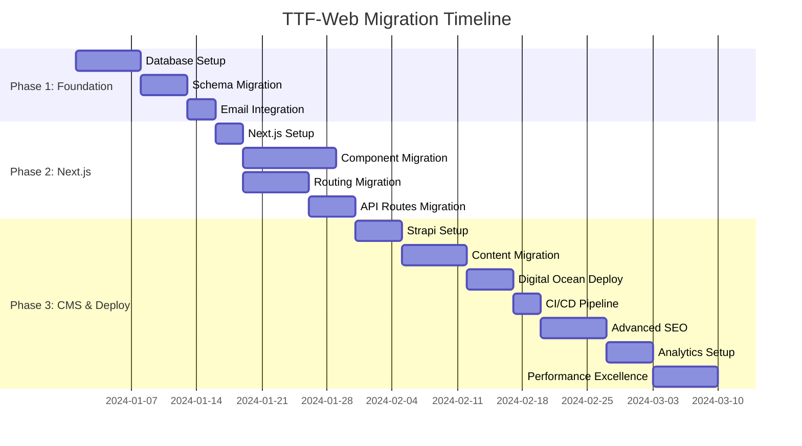

# TTF-Web Migration: Detailed Task Breakdown

## Task Dependencies and Sequencing



## MCP Tools Integration Matrix for Task Execution

### 🔧 MCP Tools by Development Phase

| Phase | High Priority MCP | Medium Priority MCP | Low Priority MCP | Continuous Monitoring |
|-------|------------------|-------------------|------------------|---------------------|
| **Phase 1: Foundation** | Context7 MCP, Supabase MCP | GitHub MCP, DigitalOcean MCP | Git MCP, Perplexity MCP | Lighthouse MCP |
| **Phase 2: Next.js Migration** | Context7 MCP, Browser Use MCP, Lighthouse MCP | GitHub MCP, Supabase MCP | Git MCP, Brave Search MCP | All MCP Tools |
| **Phase 3: CMS & Deploy** | DigitalOcean MCP, Lighthouse MCP, Browser Use MCP | Supabase MCP, GitHub MCP | Perplexity MCP, Brave Search MCP | All MCP Tools |

### 🎯 MCP Task Integration Pattern

Every major task follows this MCP integration pattern:

```bash
# MCP Pre-Task Validation
npx -y @upstash/context7-mcp@latest resolve-library-id --library="[relevant-library]"
npx lighthouse-mcp get_performance_score --url="http://localhost:3000" --device="mobile"

# MCP Continuous Monitoring (every 5 minutes during development)
while true; do
  npx lighthouse-mcp run_audit --url="http://localhost:3000" --categories="performance,accessibility"
  sleep 300
done &

# MCP Post-Task Verification
npx lighthouse-mcp run_audit --url="http://localhost:3000" --device="mobile" --throttling=true
```

### 📊 MCP Performance Gates

**Performance Thresholds (enforced via MCP Lighthouse):**
- **Phase 1**: Lighthouse Performance ≥ 85 (Foundation target)
- **Phase 2**: Lighthouse Performance ≥ 90 (Migration target)  
- **Phase 3**: Lighthouse Performance ≥ 95 (Excellence target, aspiring for 99)

**Accessibility Thresholds (enforced via MCP Lighthouse):**
- All Phases: Lighthouse Accessibility ≥ 95

## Phase 1: Foundation & Database Setup

### 🔧 Phase 1 MCP Requirements
**Primary MCP Tools**: Context7 MCP (documentation), Supabase MCP (database)
**Secondary MCP Tools**: GitHub MCP (repository), Git MCP (version control)
**Monitoring MCP Tools**: Lighthouse MCP (performance baseline)

### Task 1.1: Supabase PostgreSQL Setup
**Dependencies**: None  
**Blockers**: None  
**Priority**: Critical

#### Subtasks:
- [ ] **1.1.1**: Create Supabase project
  - Access Supabase dashboard
  - Create new project with PostgreSQL 14+
  - Configure project settings and security
  - Document connection details
  
- [ ] **1.1.2**: Configure environment variables
  - Set up `.env.local` for development
  - Configure production environment variables
  - Test database connection
  - Verify SSL configuration

- [ ] **1.1.3**: Set up connection pooling
  - Configure Supabase connection pooling
  - Test connection limits and performance
  - Set up monitoring for connection health
  - Document connection best practices

#### MCP Pre-Task Validation:
```bash
# Context7 MCP: Get Supabase documentation
npx -y @upstash/context7-mcp@latest resolve-library-id --library="supabase"
npx -y @upstash/context7-mcp@latest get-library-docs --context7CompatibleLibraryID="/supabase/supabase" --topic="postgresql-setup"

# Supabase MCP: Validate connection prerequisites
npx -y @supabase/mcp-server-supabase@latest get_project_url --project_id="[project-id]"
```

#### MCP Continuous Monitoring:
```bash
# Monitor database connection health every 5 minutes
npx -y @supabase/mcp-server-supabase@latest get_logs --project_id="[project-id]" --service="postgres"
```

#### Acceptance Criteria:
- [ ] Database connection successful from local environment
- [ ] Environment variables properly configured  
- [ ] Connection pooling working correctly
- [ ] Basic security rules applied
- [ ] **MCP Supabase Validation**: Connection test passes via `get_project_url`
- [ ] **MCP Context7 Integration**: Supabase documentation accessible

---

### Task 1.2: Database Schema Migration
**Dependencies**: Task 1.1 complete  
**Blockers**: None  
**Priority**: Critical

#### Subtasks:
- [ ] **1.2.1**: Create base schema from existing Drizzle definitions
  ```sql
  -- Migrate from shared/schema.ts to SQL
  CREATE TABLE users (...);
  CREATE TABLE inquiries (...);
  ```

- [ ] **1.2.2**: Create clean database schema
  ```sql
  -- Simple, focused schema for immediate needs
  CREATE TABLE users (...);
  CREATE TABLE inquiries (...);
  ```

- [ ] **1.2.3**: Implement basic security policies
  ```sql
  -- Basic security setup
  ALTER TABLE users ENABLE ROW LEVEL SECURITY;
  ALTER TABLE inquiries ENABLE ROW LEVEL SECURITY;
  ```

- [ ] **1.2.4**: Create migration scripts
  - Write migration up/down scripts
  - Test migration on development database
  - Create data seeding scripts
  - Document migration process

#### MCP Pre-Task Validation:
```bash
# Context7 MCP: Get PostgreSQL best practices
npx -y @upstash/context7-mcp@latest get-library-docs --context7CompatibleLibraryID="/supabase/supabase" --topic="database-schema"

# Supabase MCP: Validate current database state
npx -y @supabase/mcp-server-supabase@latest list_tables --project_id="[project-id]" --schemas="public"
```

#### MCP Post-Task Verification:
```bash
# Supabase MCP: Verify schema creation
npx -y @supabase/mcp-server-supabase@latest execute_sql --project_id="[project-id]" --query="SELECT table_name FROM information_schema.tables WHERE table_schema='public'"

# Supabase MCP: Test RLS policies
npx -y @supabase/mcp-server-supabase@latest get_advisors --project_id="[project-id]" --type="security"
```

#### Acceptance Criteria:
- [ ] All tables created successfully
- [ ] Clean database schema implemented
- [ ] RLS policies working correctly
- [ ] Migration scripts tested and documented
- [ ] **MCP Supabase Validation**: Schema verified via `list_tables`
- [ ] **MCP Security Check**: No security advisors warnings

---

### Task 1.3: Data Migration Strategy
**Dependencies**: Task 1.2 complete  
**Blockers**: None  
**Priority**: High

#### Subtasks:
- [ ] **1.3.1**: Analyze current MemStorage data
  - Document existing data structure in `server/storage.ts`
  - Identify data to migrate (users, inquiries)
  - Create data export utilities
  - Validate data integrity

- [ ] **1.3.2**: Create migration utilities
  ```typescript
  // tools/migrate-data.ts
  export async function migrateFromMemStorage() {
    // Export from MemStorage
    // Transform data for PostgreSQL
    // Import to Supabase with validation
  }
  ```

- [ ] **1.3.3**: Test migration process
  - Create test data in MemStorage
  - Run migration scripts
  - Verify data integrity
  - Test rollback procedures

#### MCP Pre-Task Validation:
```bash
# Context7 MCP: Data migration best practices
npx -y @upstash/context7-mcp@latest get-library-docs --context7CompatibleLibraryID="/supabase/supabase" --topic="data-migration"

# Git MCP: Backup current state
npx /opt/homebrew/bin/python3.11 -m mcp_server_git git_status --repo_path="."
npx /opt/homebrew/bin/python3.11 -m mcp_server_git git_add --repo_path="." --files=["server/storage.ts"]
```

#### MCP Post-Task Verification:
```bash
# Supabase MCP: Validate data integrity
npx -y @supabase/mcp-server-supabase@latest execute_sql --project_id="[project-id]" --query="SELECT COUNT(*) FROM users"
npx -y @supabase/mcp-server-supabase@latest execute_sql --project_id="[project-id]" --query="SELECT COUNT(*) FROM inquiries"
```

#### Acceptance Criteria:
- [ ] Migration utilities created and tested
- [ ] Data validation successful
- [ ] Rollback procedures documented
- [ ] No data loss during migration
- [ ] **MCP Data Validation**: Record counts match via SQL queries
- [ ] **MCP Git Backup**: Current state safely committed

---

### Task 1.4: Email System Preparation
**Dependencies**: Task 1.2 complete  
**Blockers**: None  
**Priority**: Medium

#### Subtasks:
- [ ] **1.4.1**: Update SendGrid integration for serverless
  ```typescript
  // lib/email-serverless.ts
  import sgMail from '@sendgrid/mail';
  
  // Optimize for Next.js API routes
  export async function sendContactNotification(data: ContactForm) {
    // Serverless-optimized email sending
  }
  ```

- [ ] **1.4.2**: Update email templates
  - Migrate from `server/email.ts`
  - Add tenant-aware email templates
  - Test email functionality
  - Verify deliverability

#### MCP Pre-Task Validation:
```bash
# Context7 MCP: SendGrid serverless integration
npx -y @upstash/context7-mcp@latest resolve-library-id --library="sendgrid"
npx -y @upstash/context7-mcp@latest get-library-docs --context7CompatibleLibraryID="/sendgrid/sendgrid-nodejs" --topic="serverless"

# GitHub MCP: Check for email configuration
npx github-mcp-server search_code --q="SendGrid repo:current-repo"
```

#### MCP Post-Task Verification:
```bash
# Lighthouse MCP: Performance impact assessment
npx lighthouse-mcp run_audit --url="http://localhost:3000/contact" --categories="performance"
```

#### Acceptance Criteria:
- [ ] Email integration working in serverless environment
- [ ] Templates updated and tested
- [ ] Email deliverability verified
- [ ] Error handling implemented
- [ ] **MCP Context7 Integration**: SendGrid docs accessible
- [ ] **MCP Performance Gate**: No performance regression on contact page

## Phase 2: Next.js 15 App Router Migration

### 🔧 Phase 2 MCP Requirements  
**Primary MCP Tools**: Context7 MCP (Next.js docs), Browser Use MCP (testing), Lighthouse MCP (performance)
**Secondary MCP Tools**: GitHub MCP (repository), Supabase MCP (database), Git MCP (version control)
**Monitoring MCP Tools**: All MCP Tools (comprehensive monitoring)

### Task 2.1: Next.js 15 Project Setup
**Dependencies**: Phase 1 complete  
**Blockers**: None  
**Priority**: Critical

#### Subtasks:
- [ ] **2.1.1**: Initialize Next.js 15 project
  ```bash
  npx create-next-app@latest ttf-web-nextjs \
    --typescript \
    --tailwind \
    --eslint \
    --app \
    --src-dir \
    --import-alias "@/*"
  ```

- [ ] **2.1.2**: Configure TypeScript and ESLint
  - Copy and adapt existing TypeScript configuration
  - Set up ESLint rules compatible with Next.js
  - Configure path mapping and imports
  - Test build process

- [ ] **2.1.3**: Set up TailwindCSS configuration
  - Copy existing Tailwind configuration
  - Add Next.js-specific optimizations
  - Test styling compilation
  - Verify custom colors and utilities

- [ ] **2.1.4**: Install and configure dependencies
  ```bash
  npm install @supabase/supabase-js
  npm install @tanstack/react-query
  npm install react-hook-form @hookform/resolvers/zod
  npm install framer-motion
  npm install lucide-react
  # ... other dependencies from package.json
  ```

#### MCP Pre-Task Validation:
```bash
# Context7 MCP: Next.js 15 setup documentation
npx -y @upstash/context7-mcp@latest resolve-library-id --library="next.js"
npx -y @upstash/context7-mcp@latest get-library-docs --context7CompatibleLibraryID="/vercel/next.js" --topic="installation"

# Context7 MCP: App Router documentation
npx -y @upstash/context7-mcp@latest get-library-docs --context7CompatibleLibraryID="/vercel/next.js" --topic="app-router"
```

#### MCP Continuous Monitoring:
```bash
# Lighthouse MCP: Monitor setup progress
npx lighthouse-mcp get_performance_score --url="http://localhost:3000" --device="mobile"

# Browser Use MCP: Automated testing
npx /Users/adamkovacs/Documents/codebuild/mcp-servers/mcp-browser-use/.venv/bin/python -m mcp_browser_use.server initialize_browser --headless=false --task="Test Next.js setup"
```

#### MCP Post-Task Verification:
```bash
# Browser Use MCP: Verify project setup
npx /Users/adamkovacs/Documents/codebuild/mcp-servers/mcp-browser-use/.venv/bin/python -m mcp_browser_use.server go_to_url --url="http://localhost:3000"
npx /Users/adamkovacs/Documents/codebuild/mcp-servers/mcp-browser-use/.venv/bin/python -m mcp_browser_use.server validate_page --expected_text="Next.js"

# Lighthouse MCP: Performance baseline
npx lighthouse-mcp run_audit --url="http://localhost:3000" --categories="performance,accessibility,best-practices"
```

#### Acceptance Criteria:
- [ ] Next.js 15 project running successfully
- [ ] All dependencies installed and configured
- [ ] TypeScript compilation working
- [ ] TailwindCSS styling working
- [ ] **MCP Context7 Integration**: Next.js documentation accessible
- [ ] **MCP Browser Validation**: Home page loads successfully
- [ ] **MCP Performance Gate**: Lighthouse Performance ≥ 85

---

### Task 2.2: Component Migration Strategy
**Dependencies**: Task 2.1 complete  
**Blockers**: None  
**Priority**: Critical

#### Subtasks:
- [ ] **2.2.1**: Create component compatibility matrix
  ```typescript
  // Document each component migration:
  // - Button: ✅ Compatible with minor updates
  // - Form: ⚠️ Requires import path updates
  // - Toast: ✅ Compatible
  // - Dialog: ⚠️ Requires portal updates
  ```

- [ ] **2.2.2**: Migrate core UI components (Phase 1)
  - Button, Input, Label components
  - Form components (Form, FormField, FormItem, etc.)
  - Toast and Toaster components
  - Test each component individually

- [ ] **2.2.3**: Migrate layout components (Phase 2)
  - Layout component
  - Navigation component
  - Footer component
  - Test layout rendering

- [ ] **2.2.4**: Migrate specialized components (Phase 3)
  - ScrollAnimations component
  - Complex dialog and modal components
  - Any custom business logic components
  - Integration testing

#### MCP Pre-Task Validation:
```bash
# Context7 MCP: Shadcn/ui component documentation
npx -y @upstash/context7-mcp@latest resolve-library-id --library="shadcn/ui"
npx -y @upstash/context7-mcp@latest get-library-docs --context7CompatibleLibraryID="/shadcn/ui" --topic="installation"

# Git MCP: Create feature branch
npx /opt/homebrew/bin/python3.11 -m mcp_server_git git_create_branch --repo_path="." --branch_name="feature/component-migration"
```

#### MCP Continuous Monitoring:
```bash
# Browser Use MCP: Component visual testing
npx /Users/adamkovacs/Documents/codebuild/mcp-servers/mcp-browser-use/.venv/bin/python -m mcp_browser_use.server initialize_browser --headless=false --task="Component migration testing"

# For each component:
npx /Users/adamkovacs/Documents/codebuild/mcp-servers/mcp-browser-use/.venv/bin/python -m mcp_browser_use.server go_to_url --url="http://localhost:3000/components/[component]"
npx /Users/adamkovacs/Documents/codebuild/mcp-servers/mcp-browser-use/.venv/bin/python -m mcp_browser_use.server validate_page --expected_text="[component-name]"
```

#### MCP Post-Task Verification:
```bash
# Lighthouse MCP: Component performance impact
npx lighthouse-mcp run_audit --url="http://localhost:3000" --categories="performance,accessibility"

# Browser Use MCP: Comprehensive component testing
npx /Users/adamkovacs/Documents/codebuild/mcp-servers/mcp-browser-use/.venv/bin/python -m mcp_browser_use.server inspect_page
```

#### Acceptance Criteria:
- [ ] All 50+ Shadcn/ui components migrated successfully
- [ ] Component imports updated for Next.js
- [ ] Visual testing confirms styling integrity
- [ ] No TypeScript errors
- [ ] **MCP Context7 Integration**: Shadcn/ui docs accessible
- [ ] **MCP Browser Validation**: All components render correctly
- [ ] **MCP Performance Gate**: No performance regression

---

### Task 2.3: Routing Migration (wouter → App Router)
**Dependencies**: Task 2.2 complete  
**Blockers**: None  
**Priority**: Critical

#### Subtasks:
- [ ] **2.3.1**: Create App Router file structure
  ```
  app/
  ├── layout.tsx
  ├── page.tsx                    # Home (was Route path="/")
  ├── about/page.tsx              # About (was Route path="/about")
  ├── contact/page.tsx            # Contact (was Route path="/contact")
  ├── who-we-serve/page.tsx       # Who We Serve
  └── services/
      ├── layout.tsx              # Services layout
      ├── page.tsx                # Services overview
      ├── accelerate/page.tsx     # Individual service pages
      ├── elevate/page.tsx
      ├── illuminate/page.tsx
      └── innovate/page.tsx
  ```

- [ ] **2.3.2**: Update navigation components
  ```typescript
  // Replace wouter Link with Next.js Link
  import Link from 'next/link';
  // Update all navigation references
  ```

- [ ] **2.3.3**: Implement layout hierarchy
  - Root layout with providers
  - Services layout for service pages
  - Shared layout components
  - Test layout nesting

- [ ] **2.3.4**: Test routing functionality
  - Test all route transitions
  - Verify URL structure
  - Test back/forward navigation
  - Verify 404 handling

#### MCP Pre-Task Validation:
```bash
# Context7 MCP: App Router routing documentation
npx -y @upstash/context7-mcp@latest get-library-docs --context7CompatibleLibraryID="/vercel/next.js" --topic="app-router-routing"

# GitHub MCP: Backup current routing structure
npx github-mcp-server create_branch --owner="current-owner" --repo="current-repo" --branch="backup/wouter-routing"
```

#### MCP Continuous Monitoring:
```bash
# Browser Use MCP: Route testing automation
npx /Users/adamkovacs/Documents/codebuild/mcp-servers/mcp-browser-use/.venv/bin/python -m mcp_browser_use.server initialize_browser --headless=false --task="Route migration testing"

# Test each route:
for route in "/" "/about" "/contact" "/who-we-serve" "/services"; do
  npx /Users/adamkovacs/Documents/codebuild/mcp-servers/mcp-browser-use/.venv/bin/python -m mcp_browser_use.server go_to_url --url="http://localhost:3000$route"
  npx /Users/adamkovacs/Documents/codebuild/mcp-servers/mcp-browser-use/.venv/bin/python -m mcp_browser_use.server validate_page --expected_text="page-specific-content"
done
```

#### MCP Post-Task Verification:
```bash
# Lighthouse MCP: Route performance validation
for route in "/" "/about" "/contact" "/who-we-serve" "/services"; do
  npx lighthouse-mcp run_audit --url="http://localhost:3000$route" --categories="performance,seo"
done

# Browser Use MCP: Navigation flow testing
npx /Users/adamkovacs/Documents/codebuild/mcp-servers/mcp-browser-use/.venv/bin/python -m mcp_browser_use.server click_element --index="navigation-menu-index"
```

#### Acceptance Criteria:
- [ ] All routes accessible via App Router
- [ ] Navigation working correctly
- [ ] Layout hierarchy functioning
- [ ] URL structure maintained
- [ ] **MCP Context7 Integration**: App Router docs accessible
- [ ] **MCP Browser Validation**: All routes load and navigate correctly
- [ ] **MCP Performance Gate**: All routes meet Lighthouse Performance ≥ 90

---

### Task 2.4: API Routes Migration
**Dependencies**: Task 2.3 complete  
**Blockers**: None  
**Priority**: Critical

#### Subtasks:
- [ ] **2.4.1**: Migrate `/api/contact` endpoint
  ```typescript
  // app/api/contact/route.ts
  import { NextRequest, NextResponse } from 'next/server';
  
  export async function POST(request: NextRequest) {
    // Migrate logic from server/routes.ts
    // Update database calls to use Supabase
    // Maintain same request/response format
  }
  ```

- [ ] **2.4.2**: Migrate `/api/inquiries` endpoint
  ```typescript
  // app/api/inquiries/route.ts
  export async function GET(request: NextRequest) {
    // Migrate admin inquiries endpoint
    // Add proper authentication
    // Update database queries
  }
  ```

- [ ] **2.4.3**: Update frontend API calls
  ```typescript
  // Update apiRequest calls in Contact.tsx
  // Verify request/response format compatibility
  // Test error handling
  ```

#### MCP Pre-Task Validation:
```bash
# Context7 MCP: Next.js API routes documentation
npx -y @upstash/context7-mcp@latest get-library-docs --context7CompatibleLibraryID="/vercel/next.js" --topic="api-routes"

# Supabase MCP: Database connection validation
npx -y @supabase/mcp-server-supabase@latest get_project_url --project_id="[project-id]"
```

#### MCP Continuous Monitoring:
```bash
# Browser Use MCP: API endpoint testing
npx /Users/adamkovacs/Documents/codebuild/mcp-servers/mcp-browser-use/.venv/bin/python -m mcp_browser_use.server go_to_url --url="http://localhost:3000/contact"
npx /Users/adamkovacs/Documents/codebuild/mcp-servers/mcp-browser-use/.venv/bin/python -m mcp_browser_use.server input_text --index="contact-form-name" --text="Test User"
npx /Users/adamkovacs/Documents/codebuild/mcp-servers/mcp-browser-use/.venv/bin/python -m mcp_browser_use.server click_element --index="submit-button"
```

#### MCP Post-Task Verification:
```bash
# Supabase MCP: Verify database operations
npx -y @supabase/mcp-server-supabase@latest execute_sql --project_id="[project-id]" --query="SELECT * FROM inquiries ORDER BY created_at DESC LIMIT 5"

# Lighthouse MCP: API performance impact
npx lighthouse-mcp run_audit --url="http://localhost:3000/contact" --categories="performance"
```

#### Acceptance Criteria:
- [ ] API endpoints responding correctly
- [ ] Frontend API calls working
- [ ] Error handling maintained
- [ ] Database integration functioning
- [ ] **MCP Supabase Integration**: Database operations verified
- [ ] **MCP Browser Validation**: Form submission works end-to-end
- [ ] **MCP Performance Gate**: Contact form maintains performance

---

### Task 2.5: Form Migration
**Dependencies**: Task 2.4 complete  
**Blockers**: None  
**Priority**: High

#### Subtasks:
- [ ] **2.5.1**: Migrate Contact form component
  - Copy Contact.tsx to Next.js app structure
  - Update imports for Next.js compatibility
  - Test form rendering and styling
  - Verify accessibility features

- [ ] **2.5.2**: Update form submission logic
  - Update API endpoint calls
  - Test form validation (Zod schemas)
  - Test success/error handling
  - Verify toast notifications

- [ ] **2.5.3**: Test form functionality end-to-end
  - Submit test inquiries
  - Verify database storage
  - Test email notifications
  - Verify error scenarios

#### MCP Pre-Task Validation:
```bash
# Context7 MCP: React Hook Form documentation
npx -y @upstash/context7-mcp@latest resolve-library-id --library="react-hook-form"
npx -y @upstash/context7-mcp@latest get-library-docs --context7CompatibleLibraryID="/react-hook-form/react-hook-form" --topic="validation"
```

#### MCP Continuous Monitoring:
```bash
# Browser Use MCP: Form interaction testing
npx /Users/adamkovacs/Documents/codebuild/mcp-servers/mcp-browser-use/.venv/bin/python -m mcp_browser_use.server initialize_browser --headless=false --task="Form migration testing"
npx /Users/adamkovacs/Documents/codebuild/mcp-servers/mcp-browser-use/.venv/bin/python -m mcp_browser_use.server go_to_url --url="http://localhost:3000/contact"

# Test form validation
npx /Users/adamkovacs/Documents/codebuild/mcp-servers/mcp-browser-use/.venv/bin/python -m mcp_browser_use.server click_element --index="submit-button"
npx /Users/adamkovacs/Documents/codebuild/mcp-servers/mcp-browser-use/.venv/bin/python -m mcp_browser_use.server validate_page --expected_text="required"
```

#### MCP Post-Task Verification:
```bash
# Lighthouse MCP: Form accessibility validation
npx lighthouse-mcp run_audit --url="http://localhost:3000/contact" --categories="accessibility,best-practices"

# Supabase MCP: Test data persistence
npx -y @supabase/mcp-server-supabase@latest execute_sql --project_id="[project-id]" --query="SELECT COUNT(*) FROM inquiries WHERE created_at > NOW() - INTERVAL '1 hour'"
```

#### Acceptance Criteria:
- [ ] Contact form rendering correctly
- [ ] Form validation working
- [ ] Form submission successful
- [ ] Email notifications sent
- [ ] **MCP Context7 Integration**: Form validation docs accessible
- [ ] **MCP Browser Validation**: Form interactions work correctly
- [ ] **MCP Accessibility Gate**: Lighthouse Accessibility ≥ 95

---

### Task 2.6: State Management & Query Client
**Dependencies**: Task 2.5 complete  
**Blockers**: None  
**Priority**: Medium

#### Subtasks:
- [ ] **2.6.1**: Configure TanStack Query for App Router
  ```typescript
  // app/providers.tsx
  'use client';
  
  import { QueryClient, QueryClientProvider } from '@tanstack/react-query';
  
  export function Providers({ children }: { children: React.ReactNode }) {
    // Configure for SSR and client-side hydration
  }
  ```

- [ ] **2.6.2**: Update query client configuration
  - Configure for SSR compatibility
  - Set up proper hydration
  - Test data fetching patterns
  - Verify cache behavior

#### MCP Pre-Task Validation:
```bash
# Context7 MCP: TanStack Query documentation
npx -y @upstash/context7-mcp@latest resolve-library-id --library="tanstack-query"
npx -y @upstash/context7-mcp@latest get-library-docs --context7CompatibleLibraryID="/tanstack/query" --topic="ssr"
```

#### MCP Post-Task Verification:
```bash
# Browser Use MCP: SSR hydration testing
npx /Users/adamkovacs/Documents/codebuild/mcp-servers/mcp-browser-use/.venv/bin/python -m mcp_browser_use.server go_to_url --url="http://localhost:3000"
npx /Users/adamkovacs/Documents/codebuild/mcp-servers/mcp-browser-use/.venv/bin/python -m mcp_browser_use.server validate_page --expected_text="hydrated"

# Lighthouse MCP: Performance with state management
npx lighthouse-mcp run_audit --url="http://localhost:3000" --categories="performance"
```

#### Acceptance Criteria:
- [ ] TanStack Query working in App Router
- [ ] SSR and hydration working correctly
- [ ] Data fetching and caching functional
- [ ] No hydration mismatches
- [ ] **MCP Context7 Integration**: TanStack Query docs accessible
- [ ] **MCP Performance Gate**: No performance regression with state management

### Task 2.7: CMS Integration & Deployment

#### Task 2.7.1: Strapi v5 CMS Setup
**Dependencies**: Phase 2 complete  
**Blockers**: None  
**Priority**: High

#### Subtasks:
- [ ] **2.7.1.1**: Initialize Strapi v5 project
  ```bash
  npx create-strapi-app@latest ttf-strapi \
    --quickstart \
    --no-run
  ```

- [ ] **2.7.1.2**: Configure PostgreSQL database connection
  ```javascript
  // config/database.js
  module.exports = {
    connection: {
      client: 'postgres',
      connection: {
        connectionString: process.env.DATABASE_URL,
        ssl: { rejectUnauthorized: false },
      },
    },
  };
  ```

- [ ] **2.7.1.3**: Create content types
  - Pages content type for website pages
  - Services content type for service pages
  - Team members content type
  - Settings content type for site configuration

#### MCP Pre-Task Validation:
```bash
# Context7 MCP: Strapi v5 documentation
npx -y @upstash/context7-mcp@latest resolve-library-id --library="strapi"
npx -y @upstash/context7-mcp@latest get-library-docs --context7CompatibleLibraryID="/strapi/strapi" --topic="installation"

# Supabase MCP: Database readiness check
npx -y @supabase/mcp-server-supabase@latest get_project_url --project_id="[project-id]"
```

#### MCP Post-Task Verification:
```bash
# Browser Use MCP: Strapi admin panel testing
npx /Users/adamkovacs/Documents/codebuild/mcp-servers/mcp-browser-use/.venv/bin/python -m mcp_browser_use.server go_to_url --url="http://localhost:1337/admin"
npx /Users/adamkovacs/Documents/codebuild/mcp-servers/mcp-browser-use/.venv/bin/python -m mcp_browser_use.server validate_page --expected_text="Strapi"
```

#### Acceptance Criteria:
- [ ] Strapi v5 running successfully
- [ ] Database connection established
- [ ] Content types created and configured
- [ ] Admin panel accessible
- [ ] **MCP Context7 Integration**: Strapi documentation accessible
- [ ] **MCP Browser Validation**: Admin panel loads correctly

---

#### Task 2.7.2: Content Migration Strategy
**Dependencies**: Task 2.7.1 complete  
**Blockers**: None  
**Priority**: Medium

#### Subtasks:
- [ ] **2.7.2.1**: Extract content from React components
  - Document all static content in components
  - Create content migration spreadsheets
  - Identify dynamic vs static content
  - Plan content structure in Strapi

- [ ] **2.7.2.2**: Create content migration scripts
  ```typescript
  // tools/migrate-content.ts
  export async function migrateContentToStrapi() {
    // Extract content from components
    // Format for Strapi content types
    // Import via Strapi API
  }
  ```

#### MCP Pre-Task Validation:
```bash
# GitHub MCP: Content analysis
npx github-mcp-server search_code --q="static content components repo:current-repo"

# Git MCP: Backup before content migration
npx /opt/homebrew/bin/python3.11 -m mcp_server_git git_add --repo_path="." --files=["src/components"]
npx /opt/homebrew/bin/python3.11 -m mcp_server_git git_commit --repo_path="." --message="Backup: Content before Strapi migration"
```

#### MCP Post-Task Verification:
```bash
# Browser Use MCP: Content preview testing
npx /Users/adamkovacs/Documents/codebuild/mcp-servers/mcp-browser-use/.venv/bin/python -m mcp_browser_use.server go_to_url --url="http://localhost:1337/admin/content-manager"
npx /Users/adamkovacs/Documents/codebuild/mcp-servers/mcp-browser-use/.venv/bin/python -m mcp_browser_use.server validate_page --expected_text="content types"
```

#### Acceptance Criteria:
- [ ] Content extracted and documented
- [ ] Migration scripts created
- [ ] Content imported to Strapi
- [ ] Content preview working
- [ ] **MCP GitHub Integration**: Content analysis complete
- [ ] **MCP Git Backup**: Content safely backed up

---

#### Task 2.7.3: Next.js + Strapi Integration
**Dependencies**: Task 2.7.2 complete  
**Blockers**: None  
**Priority**: High

#### Subtasks:
- [ ] **2.7.3.1**: Install and configure Strapi SDK
  ```bash
  npm install @strapi/sdk-js
  ```

- [ ] **2.7.3.2**: Implement data fetching
  ```typescript
  // lib/strapi.ts
  export async function getPageData(slug: string) {
    // Fetch from Strapi API
    // Implement caching strategy
    // Handle errors gracefully
  }
  ```

- [ ] **2.7.3.3**: Configure ISR and caching
  - Set up Incremental Static Regeneration
  - Configure cache revalidation
  - Test content updates
  - Implement on-demand revalidation

#### MCP Pre-Task Validation:
```bash
# Context7 MCP: Next.js ISR documentation
npx -y @upstash/context7-mcp@latest get-library-docs --context7CompatibleLibraryID="/vercel/next.js" --topic="isr"
```

#### MCP Post-Task Verification:
```bash
# Lighthouse MCP: ISR performance validation
npx lighthouse-mcp run_audit --url="http://localhost:3000" --categories="performance,seo"

# Browser Use MCP: Content update testing
npx /Users/adamkovacs/Documents/codebuild/mcp-servers/mcp-browser-use/.venv/bin/python -m mcp_browser_use.server go_to_url --url="http://localhost:3000/api/revalidate"
```

#### Acceptance Criteria:
- [ ] Strapi data fetching working
- [ ] ISR configuration functional
- [ ] Content updates reflected correctly
- [ ] Performance optimization achieved
- [ ] **MCP Performance Gate**: Lighthouse Performance ≥ 90 with ISR

---

#### Task 2.7.4: Digital Ocean App Platform Deployment
**Dependencies**: Task 2.7.3 complete  
**Blockers**: Access tokens needed from user  
**Priority**: Critical

#### Subtasks:
- [ ] **2.7.4.1**: Set up Digital Ocean CLI
  ```bash
  # User will provide access tokens
  brew install doctl
  doctl auth init
  ```

- [ ] **2.7.4.2**: Create App Platform configuration
  ```yaml
  # .do/app.yaml
  name: ttf-web
  services:
  - name: web
    # ... configuration from technical specs
  ```

- [ ] **2.7.4.3**: Configure environment variables
  - Set up production environment variables
  - Configure secrets management
  - Test environment configuration
  - Verify database connections

- [ ] **3.4.4**: Deploy and test
  - Deploy to staging environment
  - Test all functionality
  - Configure custom domain
  - Verify SSL certificates

#### MCP Pre-Task Validation:
```bash
# DigitalOcean MCP: Platform setup
npx @digitalocean/mcp list_apps --query='{"page":1,"per_page":10}'

# Context7 MCP: Deployment documentation
npx -y @upstash/context7-mcp@latest get-library-docs --context7CompatibleLibraryID="/vercel/next.js" --topic="deployment"
```

#### MCP Continuous Monitoring:
```bash
# DigitalOcean MCP: Monitor deployment progress
npx @digitalocean/mcp list_deployments --query='{"page":1}' --path='{"app_id":"[app-id]"}'
npx @digitalocean/mcp get_deployment --path='{"app_id":"[app-id]","deployment_id":"[deployment-id]"}'
```

#### MCP Post-Task Verification:
```bash
# Browser Use MCP: Production site testing
npx /Users/adamkovacs/Documents/codebuild/mcp-servers/mcp-browser-use/.venv/bin/python -m mcp_browser_use.server go_to_url --url="https://[production-domain]"
npx /Users/adamkovacs/Documents/codebuild/mcp-servers/mcp-browser-use/.venv/bin/python -m mcp_browser_use.server validate_page --expected_text="TTF"

# Lighthouse MCP: Production performance audit
npx lighthouse-mcp run_audit --url="https://[production-domain]" --categories="performance,accessibility,best-practices,seo"
```

#### Acceptance Criteria:
- [ ] Application deployed successfully
- [ ] All environment variables configured
- [ ] Custom domain working with SSL
- [ ] All functionality verified in production
- [ ] **MCP DigitalOcean Integration**: Deployment monitoring active
- [ ] **MCP Production Validation**: All critical pages load correctly
- [ ] **MCP Performance Gate**: Production Lighthouse Performance ≥ 95

---

#### Task 2.7.5: CI/CD Pipeline Setup
**Dependencies**: Task 2.7.4 complete  
**Blockers**: None  
**Priority**: Medium

#### Subtasks:
- [ ] **2.7.5.1**: Create GitHub Actions workflow
  ```yaml
  # .github/workflows/deploy.yml
  name: Deploy to Digital Ocean
  # ... workflow from technical specs
  ```

- [ ] **2.7.5.2**: Configure automated testing
  - Set up test suite
  - Configure linting and type checking
  - Test build process
  - Verify deployment trigger

#### MCP Pre-Task Validation:
```bash
# GitHub MCP: Repository workflow setup
npx github-mcp-server list_pull_requests --owner="current-owner" --repo="current-repo" --state="open"

# Context7 MCP: GitHub Actions documentation
npx -y @upstash/context7-mcp@latest get-library-docs --context7CompatibleLibraryID="/github/docs" --topic="actions"
```

#### MCP Post-Task Verification:
```bash
# GitHub MCP: Workflow validation
npx github-mcp-server create_pull_request --owner="current-owner" --repo="current-repo" --title="Test: CI/CD Pipeline" --head="test-branch" --base="main" --body="Testing automated deployment"

# DigitalOcean MCP: Deployment trigger test
npx @digitalocean/mcp create_deployment --path='{"app_id":"[app-id]"}' --body='{"force_build":true}'
```

#### Acceptance Criteria:
- [ ] CI/CD pipeline functional
- [ ] Automated testing working
- [ ] Deployment automation verified
- [ ] Rollback procedures documented
- [ ] **MCP GitHub Integration**: Workflows trigger correctly
- [ ] **MCP Deployment Automation**: Successful automated deployment

---

#### Task 2.7.6: Domain & DNS Configuration
**Dependencies**: Task 2.7.5 complete  
**Blockers**: Cloudflare access needed from user  
**Priority**: Medium

#### Subtasks:
- [ ] **2.7.6.1**: Set up Cloudflare CLI
  ```bash
  # User will provide API tokens
  npm install -g @cloudflare/wrangler
  wrangler auth login
  ```

- [ ] **2.7.6.2**: Configure DNS records
  - Point domain to Digital Ocean app
  - Configure SSL/TLS settings
  - Set up redirects
  - Test domain resolution

#### MCP Post-Task Verification:
```bash
# Browser Use MCP: Domain resolution testing
npx /Users/adamkovacs/Documents/codebuild/mcp-servers/mcp-browser-use/.venv/bin/python -m mcp_browser_use.server go_to_url --url="https://[custom-domain]"
npx /Users/adamkovacs/Documents/codebuild/mcp-servers/mcp-browser-use/.venv/bin/python -m mcp_browser_use.server validate_page --expected_text="TTF"

# Lighthouse MCP: Domain performance audit
npx lighthouse-mcp run_audit --url="https://[custom-domain]" --categories="performance,seo"
```

#### Acceptance Criteria:
- [ ] Domain pointing to new application
- [ ] SSL certificates working
- [ ] DNS propagation complete
- [ ] Redirects configured correctly
- [ ] **MCP Domain Validation**: Custom domain loads correctly
- [ ] **MCP Performance Gate**: Domain maintains performance standards

## Phase 3: Advanced Features & Optimization

### 🔧 Phase 3 MCP Requirements
**Primary MCP Tools**: Lighthouse MCP (performance), Browser Use MCP (testing), DigitalOcean MCP (optimization)
**Secondary MCP Tools**: Supabase MCP (analytics), GitHub MCP (monitoring), Context7 MCP (documentation)
**Monitoring MCP Tools**: All MCP Tools (excellence monitoring)


### Task 3.1: Analytics & Performance Monitoring
**Dependencies**: Phase 2 complete  
**Blockers**: None  
**Priority**: Medium

#### Subtasks:
- [ ] **2.7.1.1**: Integrate Google Analytics 4
  ```typescript
  // app/layout.tsx
  import { GoogleAnalytics } from '@next/third-parties/google';
  ```

- [ ] **2.7.1.2**: Set up performance monitoring
  - Web Vitals tracking
  - Error tracking with Sentry
  - Custom business metrics
  - Real User Monitoring

#### MCP Pre-Task Validation:
```bash
# Context7 MCP: Analytics integration documentation  
npx -y @upstash/context7-mcp@latest get-library-docs --context7CompatibleLibraryID="/vercel/next.js" --topic="analytics"
```

#### MCP Post-Task Verification:
```bash
# Browser Use MCP: Analytics testing
npx /Users/adamkovacs/Documents/codebuild/mcp-servers/mcp-browser-use/.venv/bin/python -m mcp_browser_use.server go_to_url --url="https://[production-domain]"
npx /Users/adamkovacs/Documents/codebuild/mcp-servers/mcp-browser-use/.venv/bin/python -m mcp_browser_use.server click_element --index="contact-link"

# Lighthouse MCP: Performance impact assessment
npx lighthouse-mcp run_audit --url="https://[production-domain]" --categories="performance"
```

#### Acceptance Criteria:
- [ ] Analytics tracking working
- [ ] Performance metrics collected
- [ ] Error tracking functional
- [ ] Custom events implemented
- [ ] **MCP Performance Gate**: Analytics don't impact Lighthouse scores

---

### Task 3.2: GDPR Compliance Implementation
**Dependencies**: Task 2.7.1 complete  
**Blockers**: None  
**Priority**: Medium

#### Subtasks:
- [ ] **2.7.2.1**: Implement cookie consent
  - Cookie consent banner
  - Preference management
  - Analytics opt-out
  - Privacy policy integration

- [ ] **2.7.2.2**: Add data handling features
  - Data export functionality
  - Data deletion procedures
  - Audit trails
  - Privacy policy updates

#### MCP Post-Task Verification:
```bash
# Browser Use MCP: GDPR compliance testing
npx /Users/adamkovacs/Documents/codebuild/mcp-servers/mcp-browser-use/.venv/bin/python -m mcp_browser_use.server go_to_url --url="https://[production-domain]"
npx /Users/adamkovacs/Documents/codebuild/mcp-servers/mcp-browser-use/.venv/bin/python -m mcp_browser_use.server validate_page --expected_text="cookie consent"

# Lighthouse MCP: Accessibility compliance check
npx lighthouse-mcp run_audit --url="https://[production-domain]" --categories="accessibility,best-practices"
```

#### Acceptance Criteria:
- [ ] Cookie consent functional
- [ ] Data rights implemented
- [ ] Privacy compliance verified
- [ ] Legal documentation updated
- [ ] **MCP Accessibility Gate**: GDPR implementation maintains Lighthouse Accessibility ≥ 95

---

### Task 3.3: Performance Optimization
**Dependencies**: Task 4.3 complete  
**Blockers**: None  
**Priority**: High

#### Subtasks:
- [ ] **4.4.1**: Optimize images and assets
  - Next.js Image optimization
  - Asset compression
  - CDN configuration
  - Lazy loading implementation

- [ ] **2.7.3.2**: Code splitting and bundling
  - Route-based code splitting
  - Component lazy loading
  - Bundle analysis
  - Performance testing

#### MCP Pre-Task Validation:
```bash
# Context7 MCP: Next.js optimization documentation
npx -y @upstash/context7-mcp@latest get-library-docs --context7CompatibleLibraryID="/vercel/next.js" --topic="optimization"
```

#### MCP Continuous Monitoring:
```bash
# Lighthouse MCP: Real-time performance monitoring (every 5 minutes)
while true; do
  npx lighthouse-mcp run_audit --url="https://[production-domain]" --categories="performance,accessibility,best-practices,seo"
  sleep 300
done &
```

#### MCP Post-Task Verification:
```bash
# Lighthouse MCP: Final performance excellence audit
npx lighthouse-mcp run_audit --url="https://[production-domain]" --device="mobile" --throttling=true
npx lighthouse-mcp run_audit --url="https://[production-domain]" --device="desktop" --throttling=false

# Browser Use MCP: Cross-browser testing
for browser in chrome firefox safari; do
  npx /Users/adamkovacs/Documents/codebuild/mcp-servers/mcp-browser-use/.venv/bin/python -m mcp_browser_use.server go_to_url --url="https://[production-domain]"
done
```

#### Acceptance Criteria:
- [ ] 95+ Lighthouse scores (aspiring for 99)
- [ ] Image optimization working
- [ ] Bundle sizes optimized
- [ ] Performance targets met
- [ ] **MCP Performance Excellence**: All Lighthouse scores ≥ 95, aspiring for 99
- [ ] **MCP Cross-Browser Validation**: Consistent performance across browsers

## Critical Success Factors

### Technical Validation
- [ ] All pages loading under 2 seconds
- [ ] No console errors in production
- [ ] Full TypeScript compliance
- [ ] All tests passing
- [ ] Accessibility compliance
- [ ] **MCP Performance Gate**: All pages achieve Lighthouse Performance ≥ 95
- [ ] **MCP Browser Validation**: Cross-browser compatibility verified
- [ ] **MCP Accessibility Gate**: Lighthouse Accessibility ≥ 95 across all pages

### Business Validation  
- [ ] Contact form functioning correctly
- [ ] Email notifications working
- [ ] Content management workflow tested
- [ ] SEO improvements measurable
- [ ] Analytics tracking verified
- [ ] **MCP End-to-End Validation**: Complete user journey tested via Browser Use MCP
- [ ] **MCP SEO Excellence**: Lighthouse SEO scores ≥ 95
- [ ] **MCP Supabase Integration**: Database operations perform optimally

### Future-Proofing Validation
- [ ] Scalable architecture patterns established
- [ ] Modern development practices implemented
- [ ] CMS workflow optimized
- [ ] Performance monitoring active
- [ ] Security measures implemented
- [ ] **MCP Monitoring Framework**: Continuous performance monitoring via Lighthouse MCP
- [ ] **MCP Development Workflow**: Context7 MCP integrated for ongoing documentation
- [ ] **MCP Deployment Pipeline**: DigitalOcean MCP automated for scaling

## Risk Mitigation Strategies

### Technical Risks
- **Component Compatibility**: Comprehensive testing matrix for all Shadcn/ui components
- **Data Migration**: Staged migration with rollback capabilities
- **Performance Regression**: Continuous monitoring and optimization
- **SEO Impact**: Proper redirects and canonical URL management

### Business Risks
- **Downtime During Migration**: Blue-green deployment strategy
- **Content Management Disruption**: Parallel CMS setup and training
- **User Experience Changes**: Gradual rollout with user feedback
- **Analytics Continuity**: Dual tracking during transition period

## CLI Tools Integration

### Digital Ocean CLI
- **Installation**: `brew install doctl` (macOS) or `apt install doctl` (Linux)
- **Authentication**: Configure API tokens for automated deployment
- **Usage**: App management, database operations, monitoring
- **Integration**: CI/CD pipeline automation

### Cloudflare CLI
- **Installation**: `npm install -g @cloudflare/wrangler`
- **Authentication**: Configure API tokens for DNS management
- **Usage**: DNS record management, cache purging, security rules
- **Integration**: Automated DNS updates during deployment

## MCP Integration Success Metrics

### 📊 MCP Performance Excellence Framework

**Lighthouse MCP Monitoring (Continuous)**:
```bash
# Real-time performance monitoring
npx lighthouse-mcp run_audit --url="[current-url]" --categories="performance,accessibility,best-practices,seo"

# Performance gates at each phase:
# Phase 1: ≥ 85 (Foundation)
# Phase 2: ≥ 90 (Migration) 
# Phase 3: ≥ 95 (Excellence, aspiring for 99)
```

**Browser Use MCP Testing (Automated)**:
```bash
# End-to-end user journey validation
npx /Users/adamkovacs/Documents/codebuild/mcp-servers/mcp-browser-use/.venv/bin/python -m mcp_browser_use.server initialize_browser --headless=false --task="Migration validation"
```

**Context7 MCP Documentation (Always Available)**:
```bash
# Development support throughout migration
npx -y @upstash/context7-mcp@latest get-library-docs --context7CompatibleLibraryID="/vercel/next.js" --topic="[current-topic]"
```

### 🎯 MCP Enforcement Commands

**Pre-Development Validation**:
```bash
#!/bin/bash
# Run before starting any development task
echo "🔧 MCP Pre-Task Validation Started..."

# Context7 MCP: Get relevant documentation
npx -y @upstash/context7-mcp@latest resolve-library-id --library="[task-library]"

# Lighthouse MCP: Baseline performance
npx lighthouse-mcp get_performance_score --url="http://localhost:3000" --device="mobile"

# Git MCP: Ensure clean state
npx /opt/homebrew/bin/python3.11 -m mcp_server_git git_status --repo_path="."

echo "✅ MCP Pre-Task Validation Complete"
```

**Post-Development Verification**:
```bash
#!/bin/bash
# Run after completing any development task
echo "🔍 MCP Post-Task Verification Started..."

# Lighthouse MCP: Performance validation
npx lighthouse-mcp run_audit --url="http://localhost:3000" --categories="performance,accessibility,best-practices,seo"

# Browser Use MCP: Functional testing
npx /Users/adamkovacs/Documents/codebuild/mcp-servers/mcp-browser-use/.venv/bin/python -m mcp_browser_use.server validate_page --expected_text="expected-content"

# Supabase MCP: Database health check (if applicable)
npx -y @supabase/mcp-server-supabase@latest get_advisors --project_id="[project-id]" --type="performance"

echo "✅ MCP Post-Task Verification Complete"
```

## Next Steps
1. **Review and approve this MCP-enhanced migration plan**
2. **Initialize MCP tools and validate connectivity**
3. **Begin Phase 1 with MCP-guided database setup and architecture foundation**
4. **Establish MCP-monitored staging environment for safe testing**
5. **Create MCP-enforced development workflow for the team**
6. **Set up continuous MCP monitoring and progress tracking systems**

---

*This task breakdown provides a comprehensive roadmap with clear dependencies, acceptance criteria, validation steps, and comprehensive MCP tool integration for the entire migration process.*